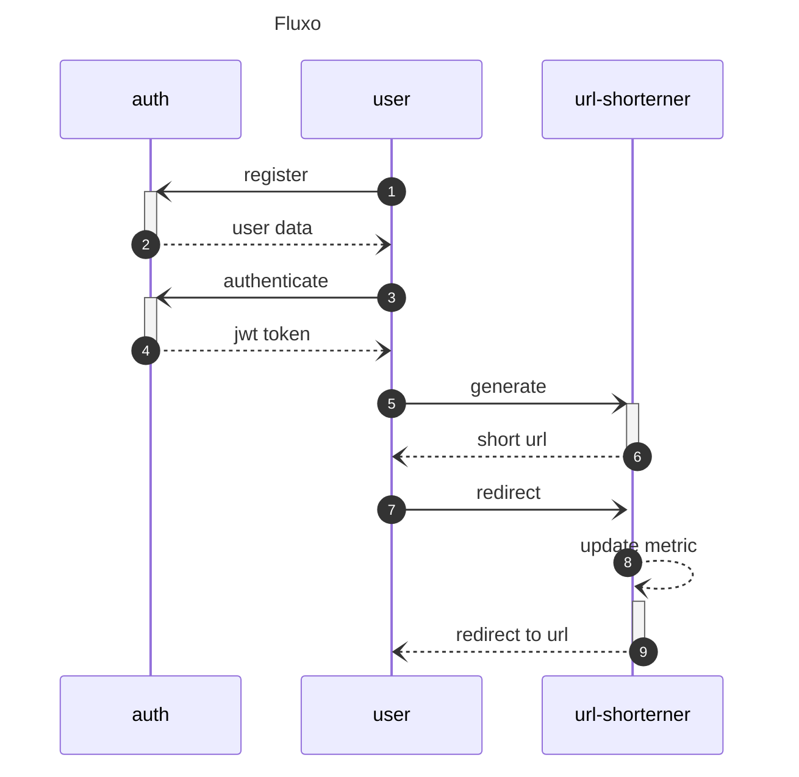

# 📚 Documentação

## 📦 Visão Geral

Este projeto é composto por dois serviços independentes:

- **Auth Service:** responsável pela autenticação e gerenciamento de usuários. Emite tokens JWT assinados com RS256.
- **URL Shortener Service:** responsável por criar, listar e gerenciar URLs encurtadas. Autentica requisições com o token JWT emitido pelo Auth Service.

---

## 🧱 Arquitetura

Exemplo de fluxo da aplicação.



A criação de URLs encurtadas **pode ser feita sem autenticação**; nesse caso, a URL será registrada **sem associação a um usuário**. No entanto, usuários autenticados têm a vantagem de poder **gerenciar suas URLs posteriormente** (listar, deletar etc.).
O projeto segue uma arquitetura em serviços (`auth` e `url-shortener`) com autenticação desacoplada. Ambos os projetos segue padrões de clean architecture e DDD, separando definições de negócio das definições ferramentais.

---

## 📌 Serviços

### 1. **Auth Service**

Responsável por:

- Registro de usuários
- Autenticação
- Emissão de tokens JWT (RS256)

#### 🔐 Segurança

- Os tokens são assinados com uma **chave privada RSA**.
- A chave **pública** é compartilhada com o serviço `url-shortener` para verificação.

#### ✨ Endpoints

| Método | Rota            | Descrição               | Autenticado |
| ------ | --------------- | ----------------------- | ----------- |
| POST   | `/authenticate` | Retorna JWT válido      | Não         |
| POST   | `/register`     | Criação da conta        | Não         |
| GET    | `/me`           | Retorna dados do perfil | Sim         |

### 2. **URL Shortener Service**

Responsável por:

- Criação de URLs encurtadas
- Redirecionamento
- Listagem e gerenciamento das URLs do usuário autenticado

#### 🔐 Autenticação

- Requisições autenticadas via JWT no header:
- Os tokens são **validados usando a chave pública RSA** fornecida pelo `auth`.

#### ✨ Endpoints

| Método | Rota               | Descrição                                   | Autenticado? |
| ------ | ------------------ | ------------------------------------------- | ------------ |
| POST   | `/generate`        | Criar nova URL encurtada                    | opcional     |
| GET    | `/:link`           | Redireciona para URL original               | Não          |
| GET    | `/list`            | Lista URLs criadas pelo usuário autenticado | Sim          |
| GET    | `/link/:shortLink` | Consulta os dados de uma url encurtada      | Sim          |
| DELETE | `/link/:shortLink` | Remove uma URL criada pelo usuário          | Sim          |
| PUT    | `/link/:shortLink` | Atualiza a url de origem                    | Sim          |

---

## 🔧 Detalhes Técnicos

### 🔑 JWT - Assinatura RS256

- **Algoritmo:** RS256 (assimétrico)
- **Serviço `auth`**: gera tokens com a **chave privada**
- **Serviço `url-shortener`**: verifica tokens com a **chave pública**

### Entities:

- user
  - updated_at
  - created_at
  - active
- link
  - owner (optional)
  - shortLink
    - max 6 characters
  - updated_at
  - created_at
  - active
- metric
  - linkId
  - clickCount
  - updated_at
  - created_at

### Stack

- Nodejs v22.15.0
- Fastify
- Zod
- Prisma
- PostgreSql

### Para executar:

Baixe o projeto deste repositório, ele contem ambos os serviços.
Acesse o diretório do projeto e gere as chaves publica e privada para assinar o JWT:

```bash
> openssl genpkey -algorithm RSA -out private.key -pkeyopt rsa_keygen_bits:2048
# gera a chave privada
> openssl rsa -pubout -in private.key -out public.key
# gera a chave publica
```

Dentro de cada projeto deverá conter uma pasta `/certs`, no projeto auth copie ambos os arquivos gerados.
Enquanto no projeto url-shortener copie para a pasta `/certs` somente a chave publica `public.key`.

Dentro de cada projeto também há um arquivo `.env.example` com as avariáveis ambiente necessárias, basta renomeá-lo para `.env`;

Dentro de cada um dos projetos rode o comando que inicia os bancos de dados:

```bash
> docker compose up
```

Realize o download dos pacotes em cada serviço:

```bash
> pnpm install
```

Realize a migração do banco:

```bash
> pnpm prisma migrate
```

Para iniciar os projetos rode ():

```bash
> pnpm start:dev
```

Para rodar os testes:

```bash
pnpm test
```
